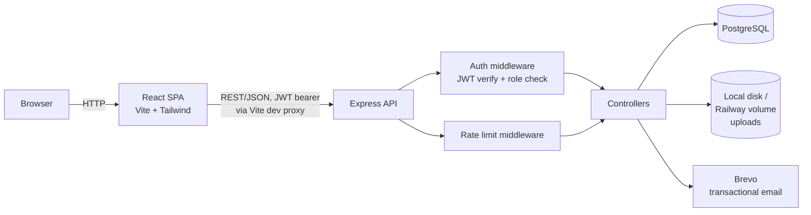
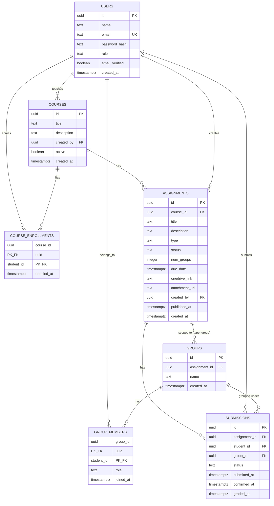

# Course, Assignment & Submission Tracking System

A role-based full-stack app, course-centric: professors run courses and publish individual or group assignments; students self-enroll, self-assemble into groups, and confirm submissions via a two-step flow; professors grade per submission.

**Stack:** React 19 + Tailwind CSS 4 (Vite) · Node.js + Express · PostgreSQL · Docker · pnpm · JWT auth · Brevo (transactional email)

## Overview of Implementation

| Role | Can do |
|---|---|
| **Student** | Register/verify/login · browse and self-enroll in courses · view published assignments in enrolled courses · for group assignments: browse open groups and join one (leader is randomly seeded at publish time) · two-step submission (individual: `Yes, I have submitted` → `Confirm submission`; group: submit, then the leader confirms everyone at once) · view own completion report |
| **Educator** | Register/verify/login · create/edit courses (active toggle to hide from student browsing) · create/edit/delete assignments (individual or group, with optional PDF/DOCX attachment and OneDrive link), draft by default · publish (individual: fans out a submission to every enrolled student; group: randomly forms N groups from enrolled students) · view per-assignment submission status by name · grade individual submissions once confirmed · look up any student's report · dashboard: courses taught + per-assignment status breakdown |

Every create/delete/publish/confirm-all action goes through a confirmation dialog (native `<dialog>`, no added dependency) rather than firing on click. Uploaded PDFs preview inline; DOCX stays a download link (no native browser renderer, and no public URL to hand a third-party viewer on `localhost`).

Full endpoint reference: [`docs/api.md`](docs/api.md). Full route/component map: [`docs/frontend.md`](docs/frontend.md).

## Setup & Run (Local)

Requires: Docker, Docker Compose, Node.js 20+, pnpm (`corepack enable`, or `npm i -g pnpm`).

```bash
git clone <repo-url>
cd task-1
cp .env.example .env
# fill in DB_USER, DB_PASSWORD, DB_NAME, JWT_SECRET, BREVO_API_KEY, etc.

# 1. Postgres + backend API (Docker)
docker compose up --build -d

# 2. Run migrations (first boot only)
docker compose exec backend pnpm run migrate

# 3. Frontend dev server (runs on the host, not in Docker)
cd frontend
pnpm install
pnpm dev
```

- Frontend: `http://localhost:5173`
- Backend API: `http://localhost:5000/api/v1` (override the host port with `BACKEND_HOST_PORT` in `.env` if 5000 is taken)
- Postgres: `localhost:5432`

The frontend has no Dockerfile — in production a single Express service serves the built frontend as static files instead of running it as a separate container (see [Deployment](#deployment) below); in local dev it just runs via `pnpm dev` against the Dockerized API through Vite's `/api` and `/uploads` proxy.

## Architecture Overview



**Backend** (`backend/src/`): `routes/` (one file per resource, plus assignment-scoped group routes nested under `routes/assignments.js`) → `controllers/` (request handling) → `services/` (business logic, e.g. the publish-time fan-out/random-leader-seeding transaction) → `db/pool.js` (raw `pg`, parameterized queries, no ORM). `middleware/` holds JWT auth, role/ownership checks, tiered rate limiting, and Zod-based request validation.

**Frontend** (`frontend/src/`): `pages/student/` and `pages/educator/` (route-level components, incl. `Courses`/`CourseDetail` per role) · `components/` (`ConfirmDialog`, `AttachmentViewer`, `Layout`, `ProtectedRoute`) · `hooks/useConfirm.js` · `context/AuthContext.jsx` + `context/ToastContext.jsx` (JWT/user and toast notifications, React Context) · `api/client.js` (one `fetch` wrapper, attaches the bearer token, throws on non-2xx).

**Request lifecycle example** — student confirms an individual submission: `PATCH /submissions/:id/confirm` → rate-limit check → JWT verified, `req.user` attached → role check (`student`) → controller loads the row and checks `student_id === req.user.id` (ownership, not just role) → rejects group submissions (`groupId` set — those move via leader confirm-all instead) → checks current `status === 'pending_confirmation'` (server-side state-machine enforcement, not just a UI gate) → updates to `waiting_for_grading`, sets `confirmed_at`.

Full diagrams, stack rationale, and the publish/self-assembly/confirm-all/grade flows: [`docs/architecture.md`](docs/architecture.md).

## Database Schema & Relationships

7 tables, no ORM — raw SQL migrations in `backend/src/migrations/`, run via a small tracked-migrations script (`schema_migrations` table records what's applied, safe to re-run).



**Key modeling decisions:**
- **One `users` table**, not separate `students`/`educators` tables — both roles share every column; only behavior differs, gated by `role`. One auth codebase serves both.
- **Courses are the top-level container.** Professors create them; students self-enroll (`course_enrollments`); assignments belong to a course. This replaced an earlier model with no course concept at all — see `CLAUDE.md`'s Database section for what changed and why.
- **No `assignment_targets` table.** Targeting is implicit and derived from data that already exists: `course_enrollments` for individual assignments, `groups`/`group_members` for group assignments — one less source of truth to keep in sync.
- **Groups are assignment-scoped, not reusable.** A group only exists in the context of one group-type assignment. Publishing randomly seeds N leaders (one group each); other students self-assemble by joining an open group.
- **`submissions` fans out per-student even for group assignments** — a progress bar needs a numerator/denominator. One row per leader at publish time, one more per student as they join.
- **`submissions.student_id` references `users` directly**, not through `group_members` — a student's submission history survives if they later leave the group.
- **4-state submission status**: `not_submitted` → `pending_confirmation` → `waiting_for_grading` → `graded`. Individual submissions self-confirm into `waiting_for_grading`; group submissions only get there via the leader's confirm-all sweep. `graded` is set per-row by the professor.
- Reports are **SQL views/aggregate queries over `submissions`**, not a stored table — avoids a cache-invalidation problem.

Full table-by-table detail and rationale: [`docs/schema.md`](docs/schema.md).

## API Endpoint Details

Base path `/api/v1`. Bearer JWT auth except where marked public. Full request/response shapes, error codes, and rate-limit tiers: [`docs/api.md`](docs/api.md).

| Resource | Endpoints |
|---|---|
| Auth | `POST /auth/register`, `GET /auth/verify`, `POST /auth/login`, `POST /auth/logout` |
| Users | `GET /users/me`, `GET /users?role=` |
| Courses | `POST /courses`, `PUT /courses/:id`, `GET /courses/mine`, `GET /courses`, `GET /courses/:id`, `POST /courses/:id/enroll` |
| Assignments | `POST /assignments`, `GET /assignments`, `GET /assignments/:id`, `PUT /assignments/:id`, `DELETE /assignments/:id`, `POST /assignments/:id/attachment`, `POST /assignments/:id/publish`, `GET /assignments/:id/groups`, `POST /assignments/:id/groups/:groupId/join` |
| Groups | `POST /groups/:id/confirm-all` |
| Submissions | `GET /submissions?assignmentId=`, `GET /submissions/mine?assignmentId=`, `PATCH /submissions/:id/submit`, `PATCH /submissions/:id/confirm`, `PATCH /submissions/:id/grade` |
| Reports | `GET /reports?studentId=`, `GET /reports?groupId=`, `GET /reports/dashboard` |

A Postman collection exists in `postman/` but predates this course-centric refactor and needs regenerating against the current endpoints — see [`docs/postman.md`](docs/postman.md).

## Key Design and Deployment Decisions

- **JWT, access-token-only, ~1hr expiry, no refresh/revocation** — a deliberate, stated tradeoff, not an oversight. See [`docs/security.md`](docs/security.md).
- **Two-step submission confirmation**, enforced server-side (not just in the UI): individual submissions self-confirm; group submissions move only via the leader's confirm-all, which proceeds even if some members never submitted (non-blocking by design, reported back as a warning).
- **File uploads to local/Docker/Railway-volume disk via Multer**, not S3/R2 — avoids cloud storage credential/bucket setup at this scale. PDF/DOCX only, 10MB cap, filenames are server-generated UUIDs (never trust the client's filename).
- **No minimum group size enforced server-side** — a group can be confirmed with just its leader. The "at least 2 members" nudge is a UI-only, non-blocking warning.
- **REST resources over RPC-style paths** — e.g. `POST /assignments/:id/publish` with no body (targeting is implicit via enrollment/group membership), not an `/assign` action carrying a target payload; reports via query params (`?studentId=`/`?groupId=`) against one endpoint, not one per entity type.
- **Tiered rate limiting** — strict (5/min) on `/auth/register` and `/auth/login`, looser elsewhere, so normal app usage (React re-fetch on navigation) never gets throttled.
- **Two independent `backend/`/`frontend/` folders, no monorepo workspace tooling** — there's no shared code between them at this scale, so pnpm workspaces would add configuration with no payoff.

### Deployment

**Topology: single Railway service.** The backend Express server serves the built frontend as static files rather than running two services — fewer moving parts (one service, one env-var set, one deploy pipeline) for an app with no need for independent frontend/backend scaling. Full steps, environment variables, and the dev-vs-prod differences table: [`docs/deployment.md`](docs/deployment.md).

## Known Scope Boundaries

Not built, deliberately — none are required by the brief:
- Educator identity/document verification
- Auto-archival of overdue assignments (cron-based auto-complete)
- Un-publishing an assignment once published (one-way transition)
- A late-enrolling student never gets fanned into an already-published individual assignment (fan-out happens once, at publish time) — a real gap for the self-enroll-anytime model, not something the current build backfills

## Further Documentation

| Doc | Covers |
|---|---|
| [`docs/schema.md`](docs/schema.md) | Full table definitions and modeling rationale |
| [`docs/architecture.md`](docs/architecture.md) | System diagram, folder structure, request lifecycle, publish/self-assembly/confirm-all/grade flows |
| [`docs/api.md`](docs/api.md) | Every endpoint — auth, request/response shapes |
| [`docs/frontend.md`](docs/frontend.md) | Route map, component inventory |
| [`docs/security.md`](docs/security.md) | Auth strategy, rate limiting, validation, stated known limitations |
| [`docs/testing.md`](docs/testing.md) | Manual verification approach and checklist |
| [`docs/testing-log.md`](docs/testing-log.md) | Full append-only log of every test run and bug found/fixed |
| [`docs/postman.md`](docs/postman.md) | Importing and running the Postman collection *(currently stale, see above)* |
| [`docs/deployment.md`](docs/deployment.md) | Annotated Docker setup and Railway deployment steps |
