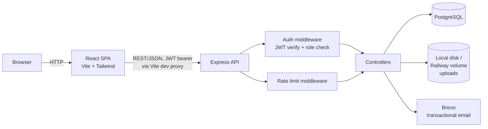
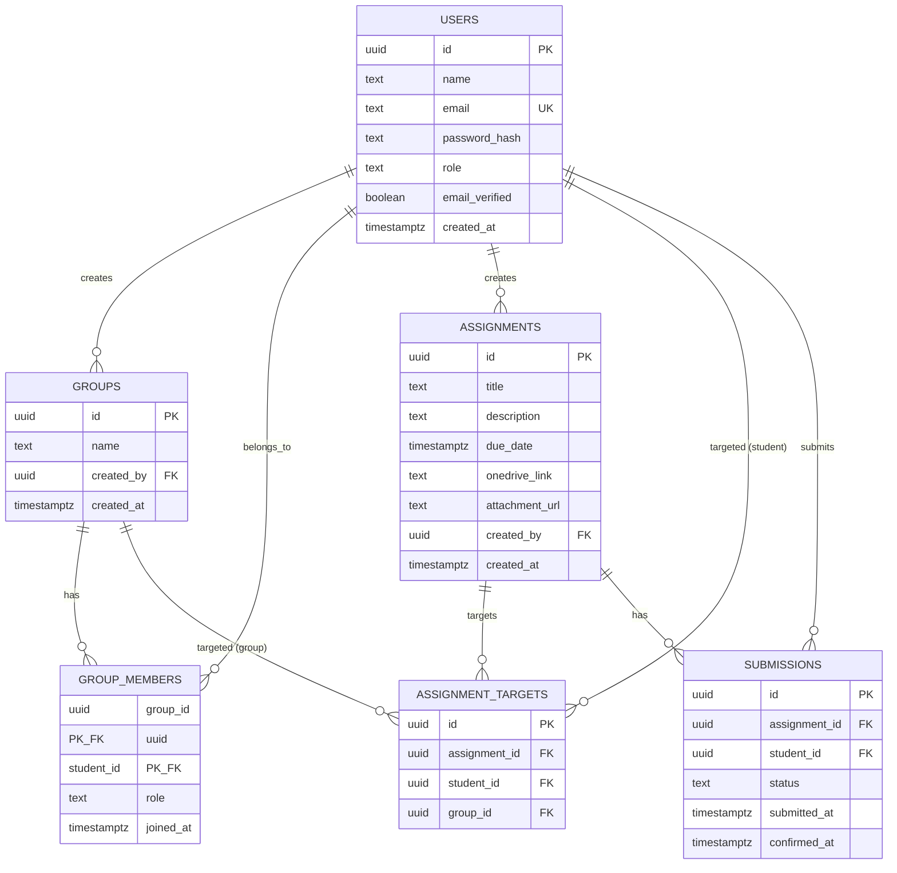

# Student, Group & Assignment Management System

A role-based full-stack app: students form groups and confirm assignment submissions via a two-step flow; educators post assignments, target them at individual students or whole groups, and track completion.

**Stack:** React 19 + Tailwind CSS 4 (Vite) · Node.js + Express · PostgreSQL · Docker · pnpm · JWT auth · Brevo (transactional email)

## Overview of Implementation

| Role | Can do |
|---|---|
| **Student** | Register/verify/login · create groups, add/remove members (leader-only) · view assignments targeted at them (individually or via group) · two-step submission (`Yes, I have submitted` → `Confirm submission`) · view own completion report |
| **Educator** | Register/verify/login · create/edit/delete assignments (with optional PDF/DOCX attachment and OneDrive link) · assign to a student or a group (fan-out creates one submission row per group member) · view per-assignment submission status (by name) · look up any student's or group's report · dashboard with aggregate completion stats |

Every create/delete/assign/submit action goes through a confirmation dialog (native `<dialog>`, no added dependency) rather than firing on click. Uploaded PDFs preview inline; DOCX stays a download link (no native browser renderer, and no public URL to hand a third-party viewer on `localhost`).

Full endpoint reference: [`docs/api.md`](docs/api.md). Full route/component map: [`docs/frontend.md`](docs/frontend.md) *(written pre-implementation — see note in that file for what changed)*.

## Setup & Run (Local)

Requires: Docker, Docker Compose, Node.js 20+, pnpm (`corepack enable`, or `npm i -g pnpm`).

```bash
git clone <repo-url>
cd task-1
cp .env.example .env
# fill in DB_USER, DB_PASSWORD, DB_NAME, JWT_SECRET, BREVO_API_KEY, etc.

# 1. Postgres + backend API (Docker)
docker compose up --build -d

# 2. Run migrations (first boot only)
docker compose exec backend pnpm run migrate

# 3. Frontend dev server (runs on the host, not in Docker)
cd frontend
pnpm install
pnpm dev
```

- Frontend: `http://localhost:5173`
- Backend API: `http://localhost:5000/api/v1` (override the host port with `BACKEND_HOST_PORT` in `.env` if 5000 is taken)
- Postgres: `localhost:5432`

The frontend has no Dockerfile — in production a single Express service serves the built frontend as static files instead of running it as a separate container (see [Deployment](#deployment) below); in local dev it just runs via `pnpm dev` against the Dockerized API through Vite's `/api` and `/uploads` proxy.

## Architecture Overview



**Backend** (`backend/src/`): `routes/` (one file per resource) → `controllers/` (request handling) → `services/` (business logic, e.g. the group-assign submission fan-out transaction) → `db/pool.js` (raw `pg`, parameterized queries, no ORM). `middleware/` holds JWT auth, role/ownership checks, tiered rate limiting, and Zod-based request validation.

**Frontend** (`frontend/src/`): `pages/student/` and `pages/educator/` (route-level components) · `components/` (`ConfirmDialog`, `AttachmentViewer`, `Layout`, `ProtectedRoute`) · `hooks/useConfirm.js` · `context/AuthContext.jsx` (JWT + user in React Context, backed by `localStorage`) · `api/client.js` (one `fetch` wrapper, attaches the bearer token, throws on non-2xx).

**Request lifecycle example** — student confirms a submission: `PATCH /submissions/:id/confirm` → rate-limit check → JWT verified, `req.user` attached → role check (`student`) → controller loads the row and checks `student_id === req.user.id` (ownership, not just role) → checks current `status === 'pending_confirmation'` (server-side state-machine enforcement, not just a UI gate) → updates to `confirmed`, sets `confirmed_at`.

Full diagrams and stack rationale: [`docs/architecture.md`](docs/architecture.md).

## Database Schema & Relationships

6 tables, no ORM — raw SQL migrations in `backend/src/migrations/`, run via a small tracked-migrations script (`schema_migrations` table records what's applied, safe to re-run).



**Key modeling decisions:**
- **One `users` table**, not separate `students`/`educators` tables — both roles share every column; only behavior differs, gated by `role`. One auth codebase serves both.
- **`assignment_targets` is polymorphic** (`student_id` XOR `group_id`, enforced by a `CHECK` constraint) — avoids a `UNION` on every "what's assigned to me" query.
- **`submissions` fans out per-student even for group assignments** — a progress bar needs a numerator/denominator; a single flag on `assignment_targets` couldn't show partial group completion. Assigning to a group inserts one `submissions` row per current member, in one transaction.
- **`submissions.student_id` references `users` directly**, not through `group_members` — a student's submission history survives if they later leave the group.
- Reports are **SQL views/aggregate queries over `submissions`**, not a stored table — avoids a cache-invalidation problem.

Full table-by-table detail and rationale: [`docs/schema.md`](docs/schema.md).

## API Endpoint Details

Base path `/api/v1`. Bearer JWT auth except where marked public. Full request/response shapes, error codes, and rate-limit tiers: [`docs/api.md`](docs/api.md).

| Resource | Endpoints |
|---|---|
| Auth | `POST /auth/register`, `GET /auth/verify`, `POST /auth/login`, `POST /auth/logout` |
| Users | `GET /users/me`, `GET /users/search?email=`, `GET /users?role=` |
| Groups | `POST /groups`, `GET /groups/:id`, `GET /groups/mine`, `GET /groups` (educator), `POST /groups/:id/members`, `DELETE /groups/:id/members/:studentId`, `DELETE /groups/:id` |
| Assignments | `POST /assignments`, `GET /assignments`, `GET /assignments/:id`, `PUT /assignments/:id`, `DELETE /assignments/:id`, `POST /assignments/:id/attachment`, `POST /assignments/:id/assign` |
| Submissions | `GET /submissions?assignmentId=`, `GET /submissions/mine?assignmentId=`, `PATCH /submissions/:id/submit`, `PATCH /submissions/:id/confirm` |
| Reports | `GET /reports?studentId=`, `GET /reports?groupId=`, `GET /reports/dashboard` |

A ready-to-import Postman collection covering the full happy path plus error cases lives in `postman/` — see [`docs/postman.md`](docs/postman.md).

## Key Design and Deployment Decisions

- **JWT, access-token-only, ~1hr expiry, no refresh/revocation** — a deliberate, stated tradeoff for assessment scope, not an oversight. See [`docs/security.md`](docs/security.md).
- **Two-step submission confirmation** (`not_submitted → pending_confirmation → confirmed`), enforced server-side (not just in the UI) — matches the brief exactly rather than collapsing to one step.
- **File uploads to local/Docker/Railway-volume disk via Multer**, not S3/R2 — avoids cloud storage credential/bucket setup at this scale. PDF/DOCX only, 10MB cap, filenames are server-generated UUIDs (never trust the client's filename).
- **No group invite accept/decline** — direct-add by the group leader only, in MVP scope. Documented as a deferred feature (see `CLAUDE.md`) with an additive, non-breaking schema path if added later.
- **REST resources over RPC-style paths** — e.g. `POST /assignments/:id/assign` with a `targetType` discriminator, not separate per-target-type routes; reports via query params (`?studentId=`/`?groupId=`) against one endpoint, not one per entity type.
- **Tiered rate limiting** — strict (5/min) on `/auth/register` and `/auth/login`, looser elsewhere, so normal app usage (React re-fetch on navigation) never gets throttled.
- **Two independent `backend/`/`frontend/` folders, no monorepo workspace tooling** — there's no shared code between them at this scale, so pnpm workspaces would add configuration with no payoff.

### Deployment

**Topology: single Railway service.** The backend Express server serves the built frontend as static files rather than running two services — fewer moving parts (one service, one env-var set, one deploy pipeline) for an app with no need for independent frontend/backend scaling. Full steps, environment variables, and the dev-vs-prod differences table: [`docs/deployment.md`](docs/deployment.md).

## Known Scope Boundaries

Not built, deliberately — none are required by the brief:
- Educator identity/document verification
- Auto-archival of overdue assignments (cron-based auto-complete)
- Group invite accept/decline (current model is direct-add by leader)
- A toast/status-indicator system and dedicated `ProgressBar`/`StatusBadge` components were planned pre-implementation (see `docs/architecture.md`, `docs/frontend.md`) but not built — the shipped UI uses inline error text and plain percentage/status text instead. Functionally complete, just less polished than originally sketched.

## Further Documentation

| Doc | Covers |
|---|---|
| [`docs/schema.md`](docs/schema.md) | Full table definitions and modeling rationale |
| [`docs/architecture.md`](docs/architecture.md) | System diagram, folder structure, request lifecycle *(frontend sections partially pre-implementation, see above)* |
| [`docs/api.md`](docs/api.md) | Every endpoint — auth, request/response shapes |
| [`docs/frontend.md`](docs/frontend.md) | Route map, component inventory *(partially pre-implementation, see above)* |
| [`docs/security.md`](docs/security.md) | Auth strategy, rate limiting, validation, stated known limitations |
| [`docs/testing.md`](docs/testing.md) | Manual verification approach and checklist |
| [`docs/testing-log.md`](docs/testing-log.md) | Full append-only log of every test run and bug found/fixed |
| [`docs/postman.md`](docs/postman.md) | Importing and running the Postman collection |
| [`docs/deployment.md`](docs/deployment.md) | Annotated Docker setup and Railway deployment steps |
