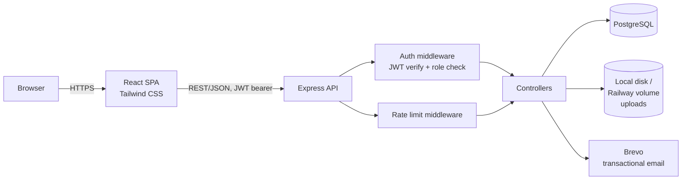

# Architecture

## System Overview



In production (Railway), the Express server also serves the built frontend as static files from a single service — see `deployment.md` for topology rationale.

## Tech Stack (with rationale)

| Layer | Choice | Why |
|---|---|---|
| Frontend | React.js + Tailwind CSS | Required by brief. Tailwind for fast, consistent UI states (success/error/info/warning/processing) without a separate CSS system. |
| Backend | Node.js + Express | Required by brief. Minimal, explicit routing — no framework magic to explain in an interview. |
| Database | PostgreSQL | Required by brief. Relational integrity (FKs, CHECK constraints) is load-bearing here — group membership, polymorphic targeting, and submission uniqueness all depend on real constraints, not application-only checks. |
| Auth | JWT, access-token-only | Simple, stateless, sufficient for assessment scope. See `security.md` for the explicit tradeoff (no revocation). |
| File upload | Multer → local disk (Docker volume / Railway volume) | Avoids S3/R2 credential and bucket setup overhead for an assessment-scale project. |
| Email | Brevo | Required by brief (transactional mail client), used for verification-link delivery. |
| Containerization | Docker + Docker Compose | Consistent dev environment from day 1, required by brief. |
| Package manager | pnpm | Strict node_modules (no phantom dependencies), fast installs. No functional advantage lost by not using workspaces — see repo structure below. |
| Deployment | Railway | Single service, backend serves built frontend statically. |

## Repo / Folder Structure

Two independent folders, no shared workspace tooling — there is no shared code between frontend and backend, so a monorepo package manager layer (pnpm workspaces) was evaluated and dropped as unnecessary complexity.

```
root/
├── docker-compose.yml
├── .env.example
├── backend/
│   ├── Dockerfile
│   ├── src/
│   │   ├── routes/          one file per resource (auth, users, groups, assignments, submissions, reports)
│   │   ├── controllers/     request handling, calls services
│   │   ├── services/        business logic (e.g. submission fan-out transaction)
│   │   ├── middleware/      auth, role check, rate limit, error handler
│   │   ├── db/               pg pool, query helpers
│   │   └── migrations/       raw SQL, numbered
│   └── uploads/               gitignored, multer target
└── frontend/
    ├── Dockerfile
    └── src/
        ├── pages/            route-level components (per role)
        ├── components/       shared UI (progress bar, badge, modal, toast/status indicator)
        ├── api/               fetch wrapper with JWT attach + 401 handling
        └── context/           auth state (current user, role, token)
```

## Request Lifecycle — Worked Example

**Student confirms a submission (two-step, second click):**

1. Browser sends `PATCH /submissions/:id/confirm` with JWT in `Authorization` header.
2. Rate-limit middleware checks request count for this IP against the read-tier limit.
3. Auth middleware verifies JWT signature and expiry, attaches `req.user = { id, role }`.
4. Role check: route requires `role === 'student'`.
5. Controller loads the `submissions` row by `id`, verifies `student_id === req.user.id` (a student can only confirm their own submission — ownership check, not just role check).
6. Verifies current `status === 'pending_confirmation'` (can't confirm a submission that hasn't been through step 1 — enforces the two-step sequence server-side, not just in the UI).
7. Updates `status = 'confirmed'`, sets `confirmed_at = now()`.
8. Returns updated row; frontend updates the progress bar for that assignment/group without a full page reload.

This example is chosen deliberately for the README/interview — it demonstrates auth, rate limiting, ownership authorization (not just role authorization), and state-machine enforcement all in one flow.

## Frontend State / UI States

Every async action (form submit, data fetch, file upload) surfaces one of: `idle`, `processing`, `success`, `error`, `info`/`warning` (e.g. "assignment due in 24 hours"). Implemented as a small shared status/toast component, not ad hoc per page, so the pattern is consistent across student and educator views — this was a stated requirement in the brief and is treated as a first-class UI concern, not an afterthought bolted on after core CRUD.
