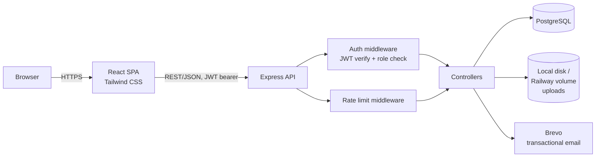

# Architecture

## System Overview



In production (Railway), the Express server also serves the built frontend as static files from a single service — see `deployment.md` for topology rationale.

## Tech Stack (with rationale)

| Layer | Choice | Why |
|---|---|---|
| Frontend | React.js + Tailwind CSS | Required by brief. Tailwind for fast, consistent UI states (success/error/info/warning/processing) without a separate CSS system. |
| Backend | Node.js + Express | Required by brief. Minimal, explicit routing — no framework magic to explain in an interview. |
| Database | PostgreSQL | Required by brief. Relational integrity (FKs, CHECK constraints) is load-bearing here — group membership, polymorphic targeting, and submission uniqueness all depend on real constraints, not application-only checks. |
| Auth | JWT, access-token-only | Simple, stateless, sufficient for assessment scope. See `security.md` for the explicit tradeoff (no revocation). |
| File upload | Multer → local disk (Docker volume / Railway volume) | Avoids S3/R2 credential and bucket setup overhead for an assessment-scale project. |
| Email | Brevo | Required by brief (transactional mail client), used for verification-link delivery. |
| Containerization | Docker + Docker Compose | Consistent dev environment from day 1, required by brief. |
| Package manager | pnpm | Strict node_modules (no phantom dependencies), fast installs. No functional advantage lost by not using workspaces — see repo structure below. |
| Deployment | Railway | Single service, backend serves built frontend statically. |

## Repo / Folder Structure

Two independent folders, no shared workspace tooling — there is no shared code between frontend and backend, so a monorepo package manager layer (pnpm workspaces) was evaluated and dropped as unnecessary complexity.

```
root/
├── docker-compose.yml
├── .env.example
├── backend/
│   ├── Dockerfile
│   ├── src/
│   │   ├── routes/          one file per resource (auth, users, groups, assignments, submissions, reports)
│   │   ├── controllers/     request handling, calls services
│   │   ├── services/        business logic (e.g. submission fan-out transaction)
│   │   ├── middleware/      auth, role check, rate limit, error handler
│   │   ├── db/               pg pool, query helpers
│   │   └── migrations/       raw SQL, numbered
│   └── uploads/               gitignored, multer target
└── frontend/
    ├── Dockerfile
    └── src/
        ├── pages/            route-level components (per role)
        ├── components/       shared UI (progress bar, badge, modal, toast/status indicator)
        ├── api/               fetch wrapper with JWT attach + 401 handling
        └── context/           auth state (current user, role, token)
```

## Request Lifecycle — Worked Example

**Student confirms an individual submission (two-step, second click):**

1. Browser sends `PATCH /submissions/:id/confirm` with JWT in `Authorization` header.
2. Rate-limit middleware checks request count for this IP against the read-tier limit.
3. Auth middleware verifies JWT signature and expiry, attaches `req.user = { id, role }`.
4. Role check: route requires `role === 'student'`.
5. Controller loads the `submissions` row by `id`, verifies `student_id === req.user.id` (a student can only confirm their own submission — ownership check, not just role check).
6. Verifies current `status === 'pending_confirmation'` (can't confirm a submission that hasn't been through step 1 — enforces the two-step sequence server-side, not just in the UI).
7. Updates `status = 'waiting_for_grading'`, sets `confirmed_at = now()`.
8. Returns updated row; frontend updates the progress bar for that assignment/group without a full page reload.

This example is chosen deliberately for the README/interview — it demonstrates auth, rate limiting, ownership authorization (not just role authorization), and state-machine enforcement all in one flow.

## New Flows (course-centric model)

**1. Publish → notify**

1. Educator hits `POST /assignments/:id/publish` on a `draft` assignment.
2. Controller loads the assignment's `course_id`, checks `created_by === req.user.id`.
3. Branch on `type`:
   - `individual`: one `submissions` row (`status='not_submitted'`) inserted per row in `course_enrollments` for that course, in a single transaction.
   - `group`: `num_groups` students are randomly selected from `course_enrollments` (excluding none already leading another group for this assignment), one `groups` row is created per selection with a `group_members` row (`role='leader'`), and one `submissions` row (`group_id` set, `status='not_submitted'`) is created for each seeded leader — all in one transaction.
4. Assignment `status` flips to `published`, `published_at = now()`.
5. Notification: no separate table. A student's dashboard query filters `assignments` by `course_id IN (their enrolled courses) AND status = 'published'`, ordered by `published_at DESC`; a simple "new" badge is a client-side comparison against `published_at` vs. the student's last-viewed timestamp (kept in browser storage, not server state) — deliberately the simplest thing that satisfies "surface newly-published assignments," not a durable notification system.

**2. Group self-assembly**

1. Student calls `GET /assignments/:id/groups` to see open groups for a group-type assignment (groups with fewer members than the assignment's expected group size, or simply all groups if no cap is enforced — capacity behavior belongs in the endpoint's implementation, not this doc).
2. Student calls `POST /assignments/:id/groups/:groupId/join`.
3. Controller verifies the student is enrolled in the assignment's course, not already a member of any group for this assignment, and the group exists for this assignment.
4. Inserts a `group_members` row (`role='member'`) and a `submissions` row (`group_id` set, `status='not_submitted'`) in one transaction.
5. A UI-side (non-blocking) warning is shown if the group is still below a sensible minimum (e.g. 2 members) — this is not enforced server-side.

**3. Leader confirm-all**

1. Group leader calls `POST /groups/:id/confirm-all`.
2. Controller verifies `req.user.id` holds `role='leader'` in `group_members` for this group.
3. Loads all `submissions` rows for the group. If any are still `not_submitted`, the response includes a warning list — but the operation proceeds anyway (leader can confirm on behalf of a partially-submitted group; this is a stated, accepted behavior, not a bug).
4. In one transaction, every row for the group (including the leader's own) with `status IN ('not_submitted', 'pending_confirmation')` is updated to `status = 'waiting_for_grading'`, `confirmed_at = now()`.
5. Returns the updated set; frontend refreshes the group's progress bar.

**4. Professor grade-per-row**

1. Educator calls `PATCH /submissions/:id/grade` from the course's assignment detail view.
2. Controller verifies the educator created the assignment this submission belongs to.
3. Verifies current `status === 'waiting_for_grading'` (can't grade a submission that hasn't been confirmed).
4. Updates `status = 'graded'`, `graded_at = now()`.
5. Returns updated row; reflected immediately in both the professor's per-assignment status breakdown and the individual student's dashboard on next fetch.

## Frontend State / UI States

Every async action (form submit, data fetch, file upload) surfaces one of: `idle`, `processing`, `success`, `error`, `info`/`warning` (e.g. "assignment due in 24 hours"). Implemented as a small shared status/toast component, not ad hoc per page, so the pattern is consistent across student and educator views — this was a stated requirement in the brief and is treated as a first-class UI concern, not an afterthought bolted on after core CRUD.
