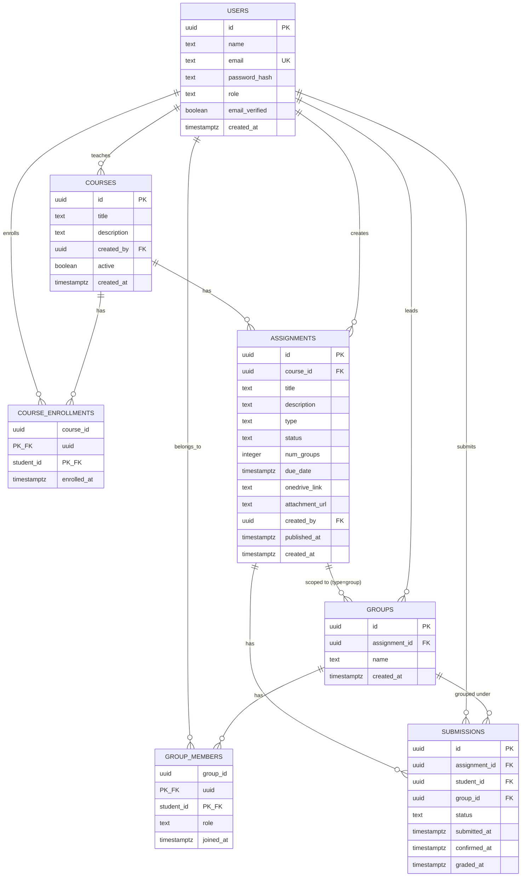

# Database Schema

PostgreSQL. 7 tables. No ORM-managed migrations — raw SQL migration files, run via a simple script (see `deployment.md`).

## ER Diagram



## Table Definitions

### `users`
Merged table for both roles (student and educator) — see "Design Rationale" below. Unchanged by this refactor.

| Column | Type | Notes |
|---|---|---|
| id | UUID | PK |
| name | TEXT | |
| email | TEXT | UNIQUE |
| password_hash | TEXT | bcrypt |
| role | TEXT | CHECK IN ('student', 'educator') |
| email_verified | BOOLEAN | default false |
| created_at | TIMESTAMPTZ | default now() |

### `courses` (new)
A course is owned by one educator ("professor" in this context) and is the top-level container assignments live under.

| Column | Type | Notes |
|---|---|---|
| id | UUID | PK |
| title | TEXT | |
| description | TEXT | nullable |
| created_by | UUID | FK → users(id), role must be 'educator' (app-layer check) |
| active | BOOLEAN | default true — toggled off to hide from student "browse courses" without deleting |
| created_at | TIMESTAMPTZ | default now() |

### `course_enrollments` (new)
Junction table, many-to-many between students and courses. Self-enroll — no approval step.

| Column | Type | Notes |
|---|---|---|
| course_id | UUID | FK → courses(id) ON DELETE CASCADE, part of composite PK |
| student_id | UUID | FK → users(id) ON DELETE CASCADE, part of composite PK |
| enrolled_at | TIMESTAMPTZ | default now() |

PK: (course_id, student_id).

### `assignments` (altered)
| Column | Type | Notes |
|---|---|---|
| id | UUID | PK |
| course_id | UUID | FK → courses(id) ON DELETE CASCADE — **new** |
| title | TEXT | |
| description | TEXT | |
| type | TEXT | CHECK IN ('individual', 'group') — **new** |
| status | TEXT | CHECK IN ('draft', 'published'), default 'draft' — **new** |
| num_groups | INTEGER | nullable, only set when type = 'group' — **new** |
| due_date | TIMESTAMPTZ | |
| onedrive_link | TEXT | external submission link |
| attachment_url | TEXT | educator-uploaded brief (PDF/docx), local disk path |
| created_by | UUID | FK → users(id) |
| published_at | TIMESTAMPTZ | nullable, set on publish — **new** |
| created_at | TIMESTAMPTZ | default now() |

```sql
CHECK (type != 'group' OR num_groups IS NOT NULL)
```

Edit allowed anytime. Delete blocked once any `submissions` row exists for this assignment (must archive instead — enforced at application layer). Publishing is a one-way transition (`draft` → `published`); un-publishing is not supported for MVP.

### `groups` (altered — assignment-scoped, no reuse)
Groups are no longer standalone/reusable objects a student creates ad hoc. A group now exists only in the context of one group-type assignment, and is created by the publish flow (seeded with a randomly-selected leader) or by a student joining an open group.

| Column | Type | Notes |
|---|---|---|
| id | UUID | PK |
| assignment_id | UUID | FK → assignments(id) ON DELETE CASCADE — **new**, NOT NULL |
| name | TEXT | e.g. "Group 1" |
| created_at | TIMESTAMPTZ | default now() |

`created_by` dropped — a group's leader is recorded via `group_members.role = 'leader'`, not a separate owner column, since leadership is what matters for the confirm-all permission check.

### `group_members`
Junction table, many-to-many between users (students) and groups. Unchanged shape.

| Column | Type | Notes |
|---|---|---|
| group_id | UUID | FK → groups(id) ON DELETE CASCADE, part of composite PK |
| student_id | UUID | FK → users(id) ON DELETE CASCADE, part of composite PK |
| role | TEXT | CHECK IN ('leader', 'member'), default 'member' |
| joined_at | TIMESTAMPTZ | default now() |

PK: (group_id, student_id). Leader is seeded at group creation (publish time); no leader-transfer flow for MVP.

### ~~`assignment_targets`~~ (dropped)
No longer needed. Targeting is now implicit:
- **Individual assignments**: every row in `course_enrollments` for the assignment's course is the target set.
- **Group assignments**: every `groups` row scoped to the assignment (via `groups.assignment_id`) is the target set; membership comes from `group_members`.

This removes a whole polymorphic join that existed only to answer "who is this assignment for" — that answer now comes directly from `course_enrollments` or `groups`/`group_members`, both of which exist for other reasons anyway.

### `submissions` (altered — new status enum, group linkage)
Always per-student, even when the assignment is group-type. This is the table progress bars and grading are computed from.

| Column | Type | Notes |
|---|---|---|
| id | UUID | PK |
| assignment_id | UUID | FK → assignments(id) ON DELETE CASCADE |
| student_id | UUID | FK → users(id) ON DELETE CASCADE |
| group_id | UUID | FK → groups(id), nullable — set for group-assignment submissions, null for individual — **new** |
| status | TEXT | CHECK IN ('not_submitted', 'pending_confirmation', 'waiting_for_grading', 'graded'), default 'not_submitted' — **changed** |
| submitted_at | TIMESTAMPTZ | set when status first moves to 'pending_confirmation' |
| confirmed_at | TIMESTAMPTZ | set when status moves to 'waiting_for_grading' (self-confirm for individual, or swept by leader confirm-all for group) |
| graded_at | TIMESTAMPTZ | set when status moves to 'graded' — **new** |

UNIQUE (assignment_id, student_id).

Note: `student_id` references `users` directly, not through `group_members`. If a student leaves a group mid-assignment, their submission row is preserved as historical record (no cascade from `group_members`).

## Reports (not a table)
Reports are computed via SQL views/aggregate queries over `submissions`, not stored.

```sql
CREATE VIEW group_progress AS
SELECT
  g.assignment_id,
  g.id AS group_id,
  COUNT(s.*) FILTER (WHERE s.status = 'graded')::float / NULLIF(COUNT(s.*), 0) AS completion_rate
FROM groups g
JOIN submissions s ON s.group_id = g.id
GROUP BY g.assignment_id, g.id;
```

Avoids the cache-invalidation problem of keeping a stored report table in sync with live submission changes. Simpler than the previous version — no `assignment_targets` join required, since `groups.assignment_id` and `submissions.group_id` now carry that relationship directly.

## Design Rationale

**Why `users` is one table, not `students` + `educators`.** Both roles share every column (name, email, password, verification state) — the only difference is behavior, gated by `role`. One table means one auth codebase (register/login/verify) serves both roles instead of duplicating it. JWT payload carries `{ userId, role }`; middleware checks `role` rather than which table the user came from.

**Why courses exist as a first-class table now.** The original model let an educator assign work directly to any student or group with no notion of a class roster. That doesn't reflect how assignment targeting actually works in practice (a professor teaches a course, students enroll in it, assignments belong to it) and made "who can even see this assignment" an application-layer question with no schema backing. `course_enrollments` gives that a real, queryable answer.

**Why `assignment_targets` was dropped.** It existed to answer "who is this assignment for," but in the new model that answer is always derivable from data that exists anyway — `course_enrollments` for individual assignments, `groups`/`group_members` for group assignments. Keeping a separate polymorphic targeting table alongside those would just be two sources of truth that could drift out of sync.

**Why `submissions` fans out per-student for group assignments.** A progress bar needs a numerator and denominator. Instead of a single flag on the group, the backend inserts one `submissions` row per group member — at publish time for the leader (seeded when the group is created), and at join time for each student who joins the group afterward.

**Why groups are assignment-scoped instead of reusable.** The new flow is self-assembly: a professor publishes a group assignment specifying `num_groups`, the system randomly picks that many leaders from the enrolled students and creates one group per leader, then other students browse and join an open group. That process only makes sense per-assignment — a group "for CS101" with no assignment attached has no meaning in this model, and reusing groups across assignments would require a many-to-many between groups and assignments that nothing in the brief calls for.
