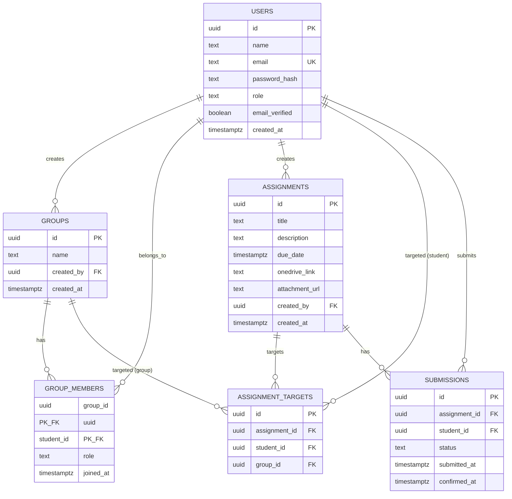

# Database Schema

PostgreSQL. 6 tables. No ORM-managed migrations — raw SQL migration files, run via a simple script (see `deployment.md`).

## ER Diagram



## Table Definitions

### `users`
Merged table for both roles (student and educator) — see "Design Rationale" below.

| Column | Type | Notes |
|---|---|---|
| id | UUID | PK |
| name | TEXT | |
| email | TEXT | UNIQUE |
| password_hash | TEXT | bcrypt |
| role | TEXT | CHECK IN ('student', 'educator') |
| email_verified | BOOLEAN | default false |
| created_at | TIMESTAMPTZ | default now() |

### `groups`
| Column | Type | Notes |
|---|---|---|
| id | UUID | PK |
| name | TEXT | |
| created_by | UUID | FK → users(id) |
| created_at | TIMESTAMPTZ | default now() |

### `group_members`
Junction table, many-to-many between users (students) and groups.

| Column | Type | Notes |
|---|---|---|
| group_id | UUID | FK → groups(id) ON DELETE CASCADE, part of composite PK |
| student_id | UUID | FK → users(id) ON DELETE CASCADE, part of composite PK |
| role | TEXT | CHECK IN ('leader', 'member'), default 'member' |
| joined_at | TIMESTAMPTZ | default now() |

PK: (group_id, student_id). Leader-only can remove members or delete the group (enforced at application layer).

### `assignments`
| Column | Type | Notes |
|---|---|---|
| id | UUID | PK |
| title | TEXT | |
| description | TEXT | |
| due_date | TIMESTAMPTZ | |
| onedrive_link | TEXT | external submission link |
| attachment_url | TEXT | educator-uploaded brief (PDF/docx), local disk path |
| created_by | UUID | FK → users(id) |
| created_at | TIMESTAMPTZ | default now() |

Edit allowed anytime. Delete blocked once any `submissions` row exists for this assignment (must archive instead — enforced at application layer, no `status` column needed for MVP since auto-archival wasn't required).

### `assignment_targets`
Polymorphic junction — one row is either a student target or a group target, never both, never neither.

| Column | Type | Notes |
|---|---|---|
| id | UUID | PK |
| assignment_id | UUID | FK → assignments(id) ON DELETE CASCADE |
| student_id | UUID | FK → users(id), NULLABLE |
| group_id | UUID | FK → groups(id), NULLABLE |

```sql
CHECK (
  (student_id IS NOT NULL AND group_id IS NULL) OR
  (student_id IS NULL AND group_id IS NOT NULL)
)
```

### `submissions`
Always per-student, even when the assignment was targeted at a group. This is the table progress bars are computed from.

| Column | Type | Notes |
|---|---|---|
| id | UUID | PK |
| assignment_id | UUID | FK → assignments(id) ON DELETE CASCADE |
| student_id | UUID | FK → users(id) ON DELETE CASCADE |
| status | TEXT | CHECK IN ('not_submitted', 'pending_confirmation', 'confirmed'), default 'not_submitted' |
| submitted_at | TIMESTAMPTZ | set on step 1 ("Yes, I have submitted") |
| confirmed_at | TIMESTAMPTZ | set on step 2 (confirm) |

UNIQUE (assignment_id, student_id).

Note: `student_id` references `users` directly, not through `group_members`. If a student leaves a group mid-assignment, their submission row is preserved as historical record (no cascade from `group_members`).

## Reports (not a table)
Reports are computed via SQL views/aggregate queries over `submissions`, not stored. Example:

```sql
CREATE VIEW group_progress AS
SELECT
  at.group_id,
  a.id AS assignment_id,
  COUNT(s.*) FILTER (WHERE s.status = 'confirmed')::float / NULLIF(COUNT(s.*), 0) AS completion_rate
FROM assignment_targets at
JOIN assignments a ON a.id = at.assignment_id
JOIN group_members gm ON gm.group_id = at.group_id
JOIN submissions s ON s.assignment_id = a.id AND s.student_id = gm.student_id
WHERE at.group_id IS NOT NULL
GROUP BY at.group_id, a.id;
```

Avoids the cache-invalidation problem of keeping a stored report table in sync with live submission changes.

## Design Rationale

**Why `users` is one table, not `students` + `educators`.** Both roles share every column (name, email, password, verification state) — the only difference is behavior, gated by `role`. One table means one auth codebase (register/login/verify) serves both roles instead of duplicating it. JWT payload carries `{ userId, role }`; middleware checks `role` rather than which table the user came from.

**Why `assignment_targets` is one polymorphic table, not two.** A student's "view all my assignments" query needs both individually-targeted and group-targeted rows in a single result set. Two separate tables force a UNION on every read. One table with a CHECK constraint enforcing exactly one target type keeps every query a single join.

**Why `submissions` fans out per-student for group assignments.** A progress bar needs a numerator and denominator. If group-level completion were tracked as a single flag on `assignment_targets`, there would be no way to show partial group progress. Instead, when an assignment targets a group, the backend inserts one `submissions` row per current `group_members` row in a single transaction at assignment-creation time.
